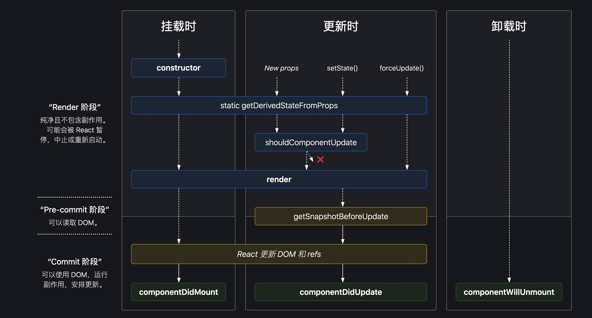

## React 生命周期

### 官网的生命周期图：

由图可知，react 生命周期大致分为三个阶段
1、挂载
2、更新
3、卸载
每个阶段都会执行一些生命周期，下面是这些生命周期详解：

1、`constructor`
`React` 组件挂载之前，会调用构造函数。构造函数一般有以下作用：
- 通过给 `this.state` 赋值，来初始化 state。
- 绑定事件处理函数实例。  
如果不初始化 `state` 或者不进行实例绑定，则不需要手动实现
`constructor`（`React` 会默认加上一个 `constructor`）。 `React` 子类实现构造函数时，`super(this)` 应该在其他语句之前调用，否则会报错。

2、`static getDerivedStateFromProps`  
`getDerivedStateFromProps` 静态方法会在 `render` 之前调用，并且初始化挂载和后续更新的时候，都会调用。
它应该返回一个对象来更新 `state`,如果返回 `null`， 则不会更新任何内容。

3、`shouldComponentUpdate`  
当 `props` 或者 `state` 变化时，`shouldComponentUpdate` 会在渲染前调用，默认返回 `true`，表示可以进行 `render`,
如果返回 `false`，则不会进行 `render`。

4、`getSnapshotBeforeUpdate`