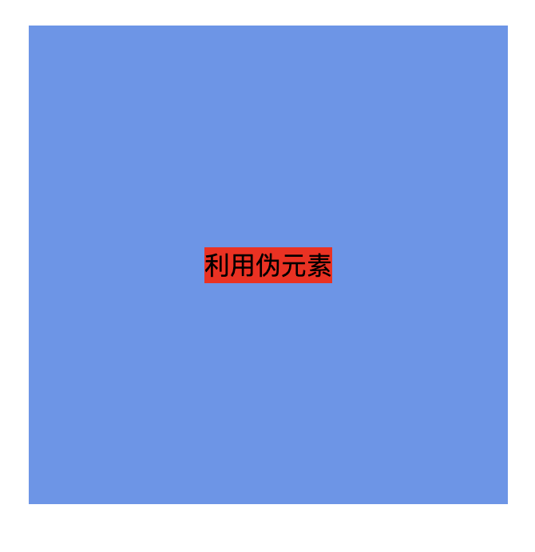
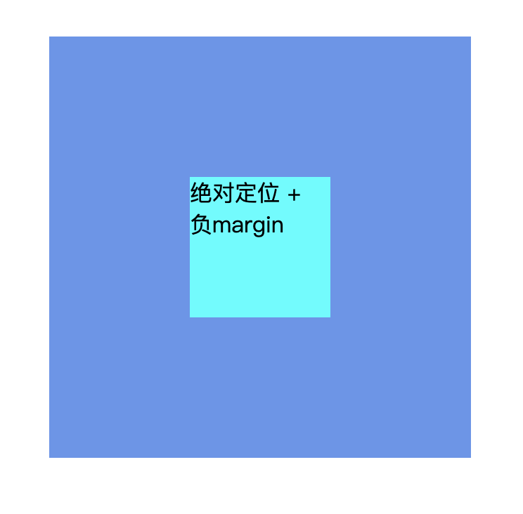
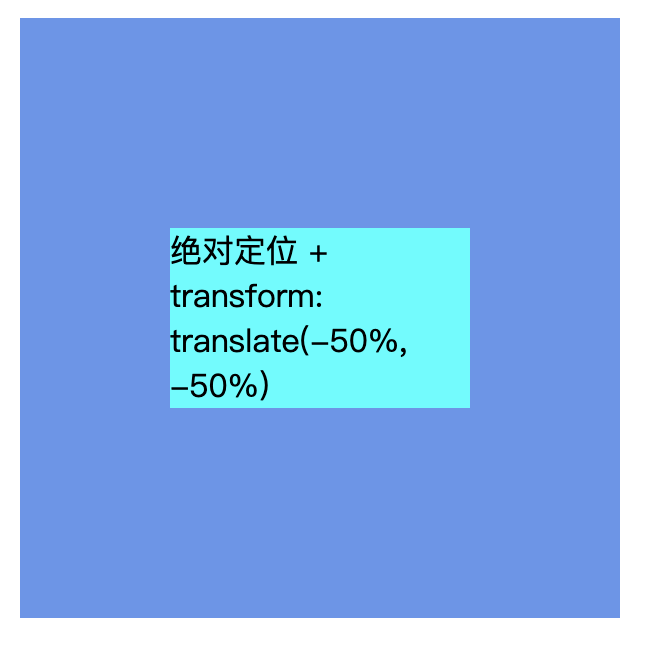
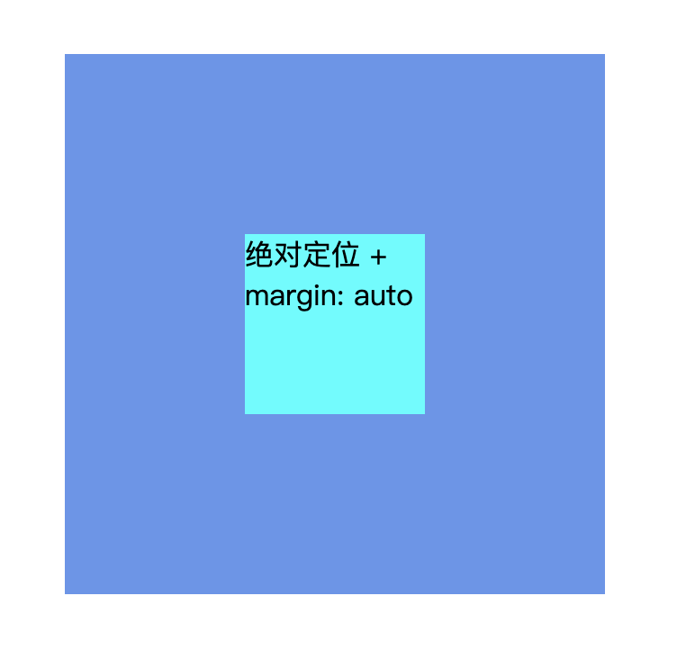
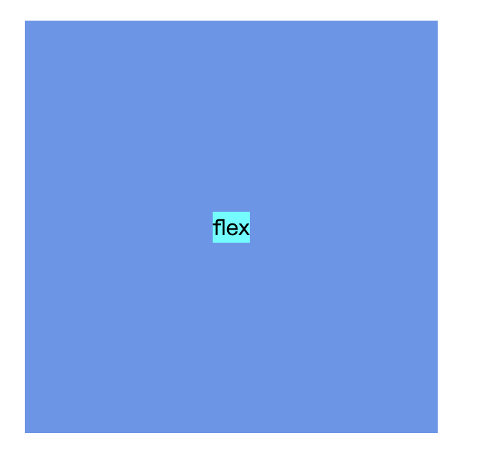

## 水平垂直居中的方法

### 1. 借助 table
*这种方法父、子元素不需要设置宽高（这里设置宽高是为了截图效果）。*
```html
<style>
    .parent {
        width: 200px;
        height: 200px;
        display: table;
        background-color: cornflowerblue;
    }

    .child {
        display: table-cell;
        background-color: aqua;
        vertical-align: middle;
        text-align: center;
    }
</style>

<div class="parent">
    <div class="child">子元素</div>
</div>
```
#### 效果


### 2. 利用伪元素
*这种方法父、子元素不需要设置宽高（这里设置宽高是为了截图效果）。 需要给伪元素设置高度撑满父元素。*

```html
<div class="parent">
      <div class="child">利用伪元素</div>
</div>

<style>
    .parent {
        width: 300px;
        height: 300px;
        background-color: cornflowerblue;
        text-align: center;
    }

    .parent::before, .parent::after {
        content:'';
        height: 100%;
        display: inline-block;
        vertical-align: middle;
    }
    .child {
        display: inline-block;
        vertical-align: middle;
        background-color: red;
    }
</style>
```
#### 效果


### 3. 绝对定位 + 负 margin
*此种方法父元素和子元素都必须设置宽高*
```html
<div class="parent">
    <div class="child">绝对定位 + 负margin</div>
</div>

<style>
    .parent{
        height: 300px;
        width: 300px;
        position: relative;
        background-color: cornflowerblue;
    }
    .child{
        width: 100px;
        height: 100px;
        background-color: aqua;
        position: absolute;
        top: 50%;
        left: 50%;
        margin-left: -50px;
        margin-top: -50px;
    }
</style>
```

#### 效果


### 4. transform: translate()
*这种方法和 负margin 一样，就是把 负的margin 换成 transform: translate(-50%, -50%)，
父元素需要规定宽高，子元素不用规定宽高。*

```html
<div class="parent">
      <div class="child">绝对定位 + transform: translate(-50%, -50%)</div>
</div>
<style>
    .parent {
        height: 300px;
        width: 300px;
        position: relative;
        background-color: cornflowerblue;
    }
    .child {
        /*width: 100px;*/
        /*height: 100px;*/
        background-color: aqua;
        position: absolute;
        top: 50%;
        left: 50%;
        transform: translate(-50%, -50%);
    }
</style>
```

#### 效果



### 5. 绝对定位 + margin: auto

*这种方法父子元素都需要给定宽高。*
```html
 <div class="parent">
      <div class="child">绝对定位 + margin: auto</div>
</div>

<style>
    .parent{
        height: 300px;
        width: 300px;
        position: relative;
        background-color: cornflowerblue;
    }
    .child{
        width: 100px;
        height: 100px;
        background-color: aqua;
        position: absolute;
        top: 0;
        left: 0;
        right: 0;
        bottom: 0;
        margin: auto;
    }
</style>
```

#### 效果


### 6. flex
*flex 布局不需要给父元素、子元素设置宽高（此处父元素设置宽高是为了截图效果）。*
```html
<div class="parent">
      <div class="child">flex</div>
</div>

<style>
    .parent{
        width: 300px;
        height: 300px;
        display: flex;
        justify-content: center;
        align-items: center;
        background-color: cornflowerblue;
    }

    .child {
        background-color: aqua;
    }
</style>
```
#### 效果
