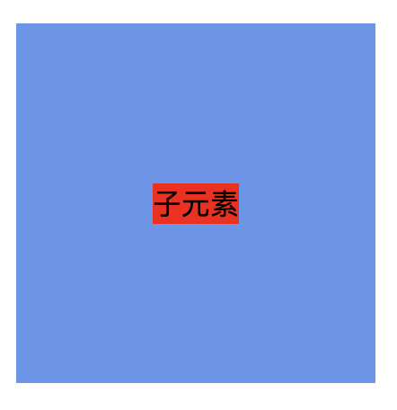

## 水平垂直居中的方法

### 1. 借助 table
*这种方法父、子元素不需要设置宽高（这里设置宽高是为了截图效果）。*
```html
<style>
    .parent {
        width: 200px;
        height: 200px;
        display: table;
        background-color: cornflowerblue;
    }

    .child {
        display: table-cell;
        background-color: aqua;
        vertical-align: middle;
        text-align: center;
    }
</style>

<div class="parent">
    <div class="child">子元素</div>
</div>
```
#### 效果
